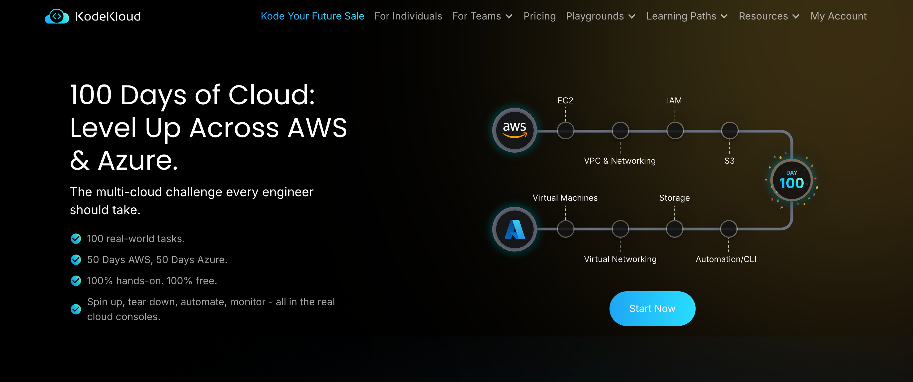
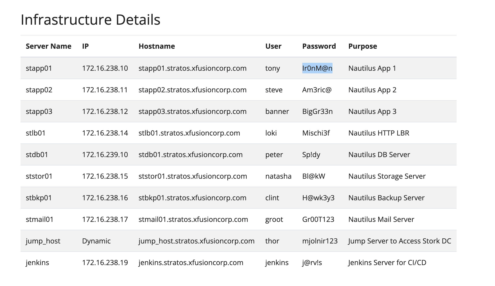

	

	
	
	

	

# 100 Días de DevOps con KodeKloud

Este repositorio documenta el desafío **100 Days of DevOps** de [KodeKloud](https://kodekloud.com/100-days-of-cloud), adaptado y compartido para la comunidad hispanohablante por **295devops** y **roxs.dev**.

---

## 🚀 ¿En qué consiste el reto?

El desafío propone realizar durante 100 días consecutivos ejercicios prácticos y conceptos clave sobre DevOps, Linux, automatización, infraestructura como código, CI/CD, contenedores, monitoreo y más. Cada día se enfoca en una tarea o aprendizaje específico, permitiendo avanzar paso a paso en el dominio de herramientas y buenas prácticas del mundo DevOps.

---

## 🎯 ¿Por qué hacerlo?

- Aprender de manera práctica y progresiva.
- Compartir avances y soluciones con la comunidad.
- Generar una base de conocimiento en español.
- Motivar la constancia y el aprendizaje colaborativo.

---

## 📂 Organización del repositorio

- Cada día tiene su propio directorio con un README donde se explica la tarea, comandos utilizados y aprendizajes.
- El repositorio se irá actualizando diariamente con nuevos retos y soluciones.

### Acceso directo a los desafíos realizados

- [Día 1: Creación de usuario Linux con shell no interactivo](./Day01_Linux_User_Setup_with_Non-Interactive_Shell/README.md)
- [Día 2: Usuario temporal con fecha de expiración](./Day02_Temporary_User_Setup_with_Expiry/README.md)
- [Día 3: Deshabilitar acceso SSH directo como root](./Day03_Secure_Root_SSH_Access/README.md)
- [Día 4: Permisos de ejecución para scripts](./Day04_Script_Execution_Permissions/README.md)
- [Día 5: Instalación y configuración de SELinux](./Day05_SElinux_Installation_and_Configuration/README.md)
- [Día 6: Crear un cron job](./Day06_Create_a_Cron_Job/README.md)
- [Día 7: Autenticación SSH sin contraseña](./Day07_Linux_SSH_Authentication/README.md)
- [Día 8: Instalar Ansible](./Day08_Install_Ansible/README.md)
- [Día 9: Troubleshooting de MariaDB](./Day09_MariaDB_Troubleshooting/README.md)
- [Día 10: Bash Scripts en Linux](./Day10_Linux_Bash_Scripts/README.md)
- [Día 11: Instalar y configurar Tomcat Server](./Day11_Install_and_Configure_Tomcat_Server/README.md)
- [Día 12: Servicios de red en Linux](./Day12_Linux_Network_Services/README.md)
- [Día 13: Instalación y configuración de IPtables](./Day13_IPtables_Installation_And_Configuration/README.md)
- [Día 14: Troubleshooting de procesos en Linux](./Day14_Linux_Process_Troubleshooting/README.md)
- [Día 15: Configurar SSL para Nginx](./Day15_Setup_SSL_for_Nginx/README.md)

---

## 👥 ¿Quiénes participan?

- Comunidad **295devops**
- Comunidad **roxs.dev**

#### Sobre roxs.dev

Este proyecto es impulsado por [roxs.dev](https://roxs.dev), espacio dedicado a compartir recursos, tutoriales y experiencias sobre DevOps, automatización y tecnología en español. Si quieres aprender más, colaborar o contactar, visita la web y únete a la comunidad.

---

---

## 👨‍💻 Autor

**roxsross** - Instructor DevOps y Cloud

🐦 [Twitter: @roxsross](https://twitter.com/roxsross)
🔗 [LinkedIn: roxsross](https://linkedin.com/in/roxsross)
☕ [Ko-fi: roxsross](https://ko-fi.com/roxsross)
▶️ [Youtube: 295devops](https://youtube.com/@295devops)
📧 Email: roxs@295devops.com

---

## 📘 Manual de Uso de la Terminal Nautilus

¿Eres nuevo/a usando la terminal o quieres una guía práctica para los laboratorios? Consulta el manual completo para aprender a conectarte por SSH, moverte entre servidores y ejecutar tareas básicas:

- [Manual de Uso de la Terminal (Linux / SSH) — Nautilus](Manual-server-nautilus.md)

Este recurso es ideal para quienes están comenzando en DevOps y quieren una referencia rápida y sencilla.

---

## 🖥️ Infrastructure Details

	

Para más información sobre la infraestructura utilizada en los retos, consulta la documentación oficial de KodeKloud:

- [Ver detalles de infraestructura en KodeKloud Nautilus](https://kodekloudhub.github.io/kodekloud-engineer/docs/projects/nautilus#infrastructure-details)

---

---

### Enlaces útiles
- [Desafío original en KodeKloud](https://kodekloud.com/100-days-of-cloud)
- [295devops](https://295devops.com)
- [roxs.dev](https://roxs.dev)

---

> Este README se irá actualizando a medida que avance el reto y se sumen nuevos aprendizajes.
